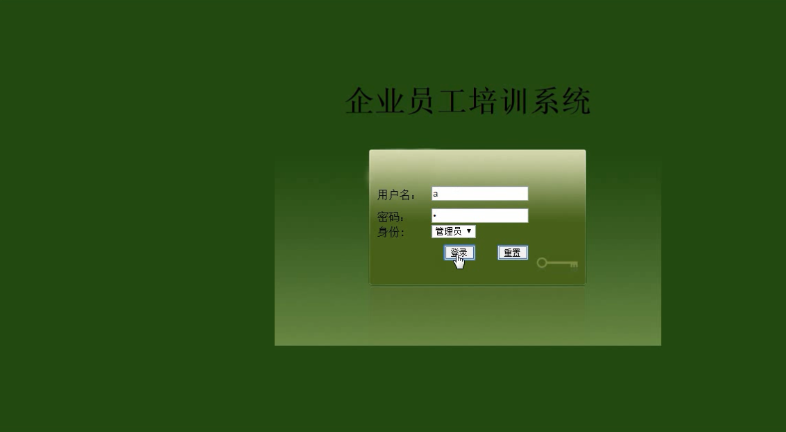

# 企业员工培训管理系统java ssh

#### 介绍
企业员工培训管理系统ssh

企业员工培训管理系统的设计与实现(SQLServer)(含录像)(毕业论文9500字,程序代码,SQLServer数据库) 

 【项目包含内容】

【项目功能介绍】

具体功能介绍如下：
（1）系统管理员负责管理整个系统，包括公司部门的管理、员工管理、培训课程的管理、培训计划的管理、培训成绩管理等功能
（2）公司部门的管理，管理本系统所有的部门信息，对于存在错误信息的部门进行修改或者删除等操作。
（3）员工信息管理，管理公司所有的员工信息，包括新员工的录入，已有员工的编辑和删除等操作。
（4）培训课程的管理，对要进行培训的课程进行管理
（5）系统管理，超级管理员和添加普通管理员，共同维护系统的安全性和管理整个系统。
（6）修改个人密码，为了保障系统运行的安全性，管理员可以修改自己的登录密码
（7）培训计划管理，改模块负责培训计划，包括录入新的培训计划和对已有的培训计划进行修改和删除等操作。 

【文档包含内容】

【文档部分截图】

【项目运行截图】 

